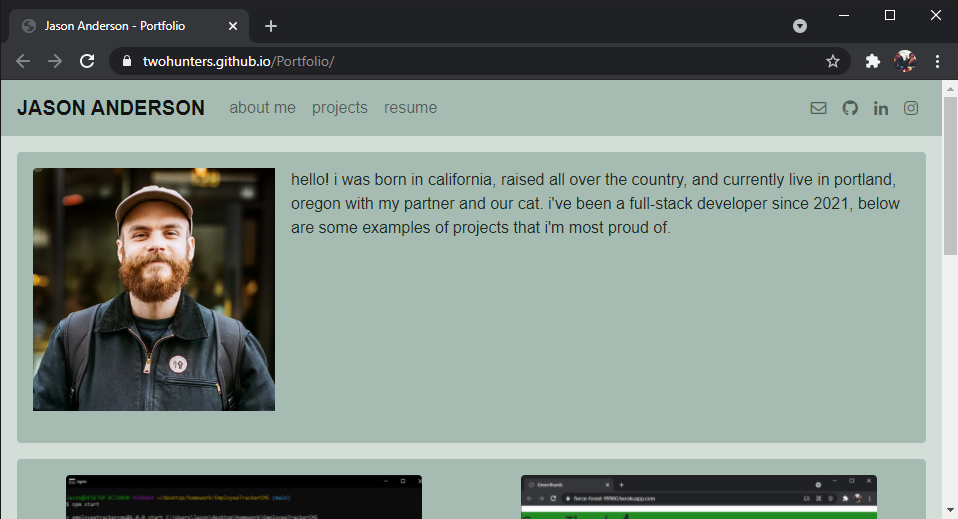

# Portfolio

## Description

This is my portfolio. It isn't much at the moment, but it's mine, and it's the foundation of an ever-changing workspace that I'll continue to build upon for years to come. Currently there are four web applications featured that I have either built myself or with others as a group, more will be added in time.

https://twohunters.github.io/Portfolio/

https://github.com/twohunters/Portfolio

## Installation

Type the following into your terminal to copy this repository:

`git clone git@github.com:twohunters/Portfolio.git`

For further instructions, visit https://help.github.com.

## Usage

This page serves as a digital portfolio of my published work as a full-stack developer, to be shared publicly and with professional associates and potential employers.

## Credits

https://github.com/twohunters

https://getbootstrap.com/

https://fontawesome.com/

## License

This is free and unencumbered software released into the public domain.

Anyone is free to copy, modify, publish, use, compile, sell, or
distribute this software, either in source code form or as a compiled
binary, for any purpose, commercial or non-commercial, and by any
means.

In jurisdictions that recognize copyright laws, the author or authors
of this software dedicate any and all copyright interest in the
software to the public domain. We make this dedication for the benefit
of the public at large and to the detriment of our heirs and
successors. We intend this dedication to be an overt act of
relinquishment in perpetuity of all present and future rights to this
software under copyright law.

THE SOFTWARE IS PROVIDED "AS IS", WITHOUT WARRANTY OF ANY KIND,
EXPRESS OR IMPLIED, INCLUDING BUT NOT LIMITED TO THE WARRANTIES OF
MERCHANTABILITY, FITNESS FOR A PARTICULAR PURPOSE AND NONINFRINGEMENT.
IN NO EVENT SHALL THE AUTHORS BE LIABLE FOR ANY CLAIM, DAMAGES OR
OTHER LIABILITY, WHETHER IN AN ACTION OF CONTRACT, TORT OR OTHERWISE,
ARISING FROM, OUT OF OR IN CONNECTION WITH THE SOFTWARE OR THE USE OR
OTHER DEALINGS IN THE SOFTWARE.

For more information, please refer to https://unlicense.org
